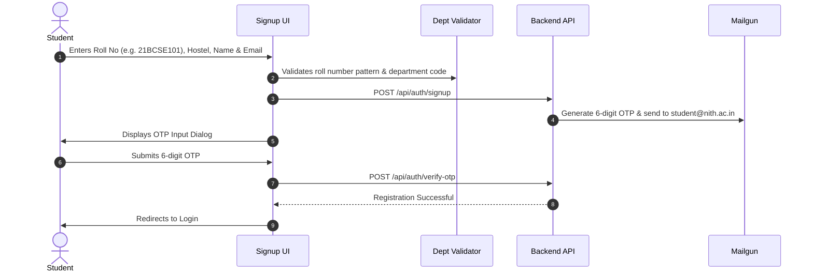

# 📱 NITH Hostel Management System — Student Portal (`hostel-frontend`)

[](https://react.dev/)
[](https://www.typescriptlang.org/)
[](https://vitejs.dev/)
[](https://tailwindcss.com/)
[](https://reactrouter.com/)

The student-facing web portal for **National Institute of Technology Hamirpur (NITH)**. It empowers resident students to authenticate with verified institutional credentials, apply for Local and Home outpasses, track administrative approval stages in real time, and present cryptographically generated QR codes at security gates for instant checkout.

---

### 🌐 Related Repositories in the NITH Ecosystem

| Repository | Description | Live GitHub Link |
| :--- | :--- | :--- |
| **`hostel-backend`** | Core REST API Gateway & PostgreSQL Database Engine | [🔗 github.com/workonlly/hostel-backend](https://github.com/workonlly/hostel-backend) |
| **`hostel-authority`** | Authority & Administration Portal (Chief Warden, Warden & Attendant Dashboards) | [🔗 github.com/workonlly/hostel-authority](https://github.com/workonlly/hostel-authority) |
| **`hostel-guard`** | Offline-First Security Terminal & Gate Scanner (Dexie.js IndexedDB & Fingerprinting) | [🔗 github.com/workonlly/hostel-guard](https://github.com/workonlly/hostel-guard) |

---

## 📑 Table of Contents

- [Key Features](#-key-features)
- [Tech Stack](#-tech-stack)
- [Directory Structure](#-directory-structure)
- [User Journey & Workflows](#-user-journey--workflows)
  - [1. Registration & Email OTP Verification](#1-registration--email-otp-verification)
  - [2. Student Dashboard & Live QR Gate Pass](#2-student-dashboard--live-qr-gate-pass)
  - [3. Outpass Application Flow](#3-outpass-application-flow)
  - [4. Outpass History & Self-Cancellation](#4-outpass-history--self-cancellation)
- [Component & State Architecture](#-component--state-architecture)
- [Environment Variables](#-environment-variables)
- [Local Setup & Development](#-local-setup--development)
- [Production Build & Nginx Deployment](#-production-build--nginx-deployment)
- [Troubleshooting & FAQs](#-troubleshooting--faqs)

---

## ✨ Key Features

- **Institutional Domain Protection:** Restricts signup to authorized `@nith.ac.in` student email addresses with automated department and degree validation.
- **Two-Factor Email OTP Verification:** Secure 6-digit OTP delivery directly to student inboxes to prevent unauthorized account creation.
- **Smart Outpass Application Forms:**
  - **Local Outpass:** Dynamic enforcement of hostel-specific cutoff timings (e.g. 5:00 PM deadline).
  - **Home / Outstation Leave:** Comprehensive multi-day date range selection, parent contact verification, and purpose description.
- **Real-Time Approval Tracking:** Instant badge updates when an outpass transitions across `Pending`, `Approved`, `Rejected`, or `Cancelled`.
- **Dynamic Gate QR Pass:** Generates a real-time QR code upon outpass approval, ready for camera scanning by Main Gate and Hostel Gate guards.
- **Self-Service Pass Cancellation:** Students can cancel pending or unused passes before leaving campus.
- **Modern Responsive Design:** Optimized for mobile phones, tablets, and desktop browsers using Tailwind CSS v4.

---

## 🛠️ Tech Stack

| Technology | Version | Purpose |
| :--- | :--- | :--- |
| **React** | `^19.2.8` | Component-driven user interface. |
| **TypeScript** | `~6.0.2` | Strong type checking across routes, models, and forms. |
| **Vite** | `^8.2.0` | Ultra-fast bundling, HMR, and build tool. |
| **Tailwind CSS** | `^4.3.3` | Utility-first responsive styling system. |
| **React Router DOM** | `^7.18.2` | Declarative client-side routing with route guards. |
| **@tanstack/react-query** | `^5.101.4` | Asynchronous state management and query caching. |
| **qrcode.react** | `^4.2.0` | SVG/Canvas QR code renderer for gate verification. |

---

## 📁 Directory Structure

```plaintext
hostel-frontend/
├── public/                    # Static assets & favicons
│   ├── favicon.svg
│   ├── icons.svg
│   └── l.png                  # Institute crest
├── src/
│   ├── assets/                # Hero graphics, SVG illustrations
│   │   ├── hero.png
│   │   └── vite.svg
│   ├── auth/                  # Student authentication subsystem
│   │   ├── departmentValidation.js # Roll number & branch parsing rules
│   │   ├── login.jsx          # Student credential login screen
│   │   ├── signup.jsx         # New student registration form
│   │   └── otpverification.jsx# 6-digit email OTP modal & validation
│   ├── students/              # Student dashboard & outpass views
│   │   ├── Dashboard.jsx      # Active outpass card, QR pass, status countdown
│   │   ├── StudentSidebar.jsx # Responsive navigation drawer
│   │   ├── outpass_form.jsx   # Local / Home outpass request forms
│   │   └── outpasses.jsx      # Historical outpass data table & status filter
│   ├── utils/                 # API communication layer
│   │   └── api.js             # Fetch/Axios wrapper with credential headers
│   ├── App.css                # Global styles
│   ├── App.tsx                # Main router & ProtectedRoute wrappers
│   ├── index.css              # Tailwind CSS imports & theme overrides
│   └── main.tsx               # Application entry point
├── Dockerfile                 # Multi-stage production container
├── nginx.conf                 # Nginx reverse proxy with SPA history fallback
├── vite.config.ts             # Vite configuration with React compiler
├── package.json
└── tsconfig.json
```

---

## 🔄 User Journey & Workflows

### 1. Registration & Email OTP Verification



---

### 2. Student Dashboard & Live QR Gate Pass

Upon login, students are greeted by the **Main Dashboard (`Dashboard.jsx`)**:

- **No Active Pass:** Displays an informative status banner and a direct **"Apply for Outpass"** call-to-action.
- **Pending Pass:** Displays an amber badge indicating waiting review from the Hostel Attendant or Warden.
- **Approved Active Pass:** 
  - Renders a high-contrast **QR Code** containing the verified outpass token and student metadata.
  - Displays departure time, expected return deadline, and allocated hostel.
  - Student presents this QR code to the guard at the campus gate.

---

### 3. Outpass Application Flow

Students navigate to `/add-outpass` to submit a request:

1. **Select Outpass Type:**
   - **Local Outpass:** Intended for short trips to nearby areas (Hamirpur market, library). Automatically checks against the hostel's `local_outpass_cutoff` (e.g. 5:00 PM).
   - **Home / Outstation Outpass:** Intended for overnight leaves or vacation. Prompts for multi-day date range and parent emergency contact number.
2. **Form Validation:** Validates required fields, date sanity (departure must precede arrival), and emergency contact phone formats.
3. **Submission:** Dispatches payload to `POST /api/outpass/apply`.

---

### 4. Outpass History & Self-Cancellation

Accessible via `/outpasses`:

- Paginated tabular list of all past outpasses with timestamps, reason, destination, and approving authority.
- Color-coded status pills: `Approved` (green), `Pending` (yellow), `Rejected` (red), `Cancelled` (slate).
- **Cancel Button:** Allows students to revoke a pending pass or an unused approved pass prior to physical gate departure.

---

## ⚙️ Component & State Architecture

### Route Protection (`ProtectedRoute`)
Located in `src/App.tsx`, the route guard ensures that unauthenticated visitors or users with unauthorized roles are redirected to `/login`:

```tsx
function ProtectedRoute({ children }: { children: React.ReactNode }) {
  const userStr = localStorage.getItem("user");
  const role = localStorage.getItem("role")?.toLowerCase();

  if (!userStr || role !== "student") {
    return <Navigate to="/login" replace />;
  }
  return children;
}
```

---

## 🔧 Environment Variables

Create a `.env` file in `hostel-frontend/`:

```env
# Backend REST API Base URL
VITE_API_URL=http://localhost:4000/api
```

For production deployments (e.g., Render or Cloud VM), point `VITE_API_URL` to your live backend domain:

```env
VITE_API_URL=https://hostel-backend-cveq.onrender.com/api
```

---

## 🚀 Local Setup & Development

### Prerequisites
- **Node.js**: `v20.x` or higher
- **npm**: `v10.x` or higher
- Backend running on `http://localhost:4000`

### Step-by-Step Installation

```bash
# 1. Navigate to frontend directory
cd hostel-frontend

# 2. Install dependencies
npm install

# 3. Create .env file
echo "VITE_API_URL=http://localhost:4000/api" > .env

# 4. Start local development server
npm run dev
```

Open your browser at **`http://localhost:5173`**.

---

## 🐳 Production Build & Nginx Deployment

### 1. Local Production Build
```bash
npm run build
npm run preview
```

### 2. Docker Container Deployment

The included `Dockerfile` performs a multi-stage build using Node.js and serves static assets via Nginx:

```bash
# Build the Docker image
docker build -t nith-hostel-frontend .

# Run container on port 5173
docker run -d -p 5173:80 --name nith-frontend nith-hostel-frontend
```

### Nginx SPA Configuration (`nginx.conf`)
```nginx
server {
    listen 80;
    server_name localhost;

    location / {
        root /usr/share/nginx/html;
        index index.html;
        try_files $uri $uri/ /index.html;
    }
}
```

---

## ❓ Troubleshooting & FAQs

### Q: Why am I receiving "Invalid Department Code" during signup?
**A:** Roll numbers at NITH adhere to strict department formats (e.g. `21BCSE...` for Computer Science, `22BECE...` for Electronics). Ensure your roll number matches the designated NITH format in `departmentValidation.js`.

### Q: Why does the Local Outpass submission fail in the evening?
**A:** Hostels enforce a strict daily outpass cutoff time (typically 5:00 PM). Applications submitted after the cutoff time are automatically blocked by the server.
